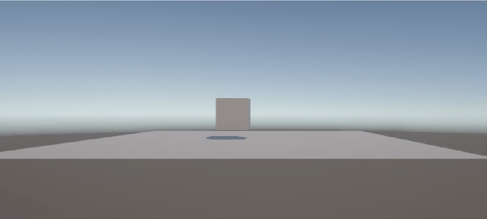

# tutorial0

## gemaakt door Kevin Mei

ik heb een blokje geplaats die kan springen als je op de spatie knop drukt

# tutorial1 en 2

## gemaakt door Kevin Mei

link voor de game die ik heb gemaakt: https://github.com/BadTimeForU/GD-HelloW-A1-KevinMei

ik heb animatie toegevoegd voor de karakter hij springt en kan lopen en heeft animaties.

